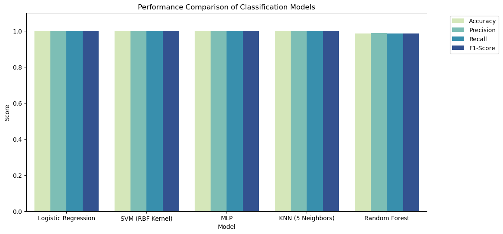
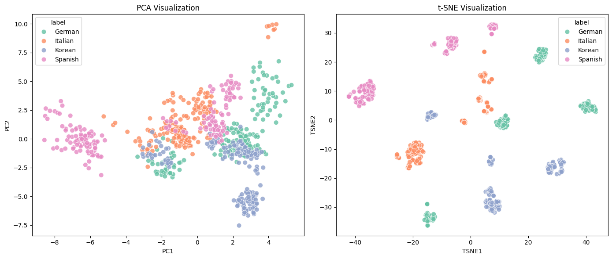
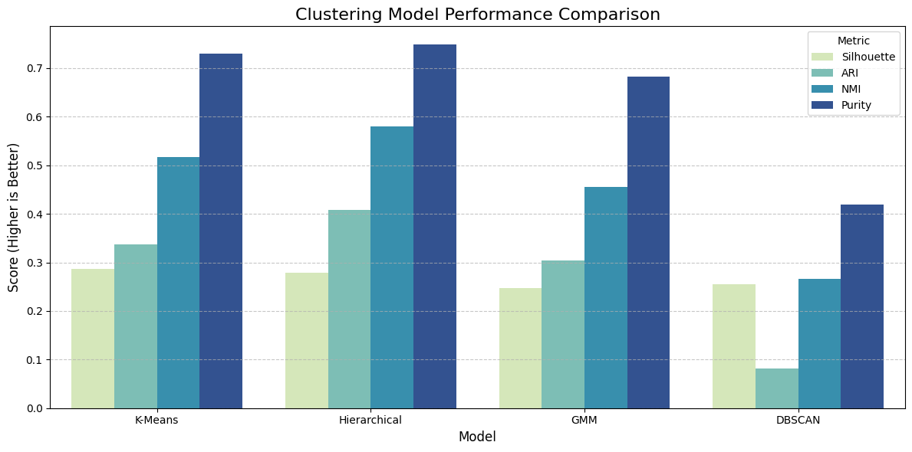

# Multilingual Speech Language Identification

A classical machine learning pipeline for **spoken-language identification** using engineered acoustic features. This project was developed as a final project for a Machine Learning course and explores both **supervised classification** and **unsupervised clustering** of multilingual speech recordings.

## Authors & Contributors

This project was jointly developed by:

- **[Mohammad Hossein Altafi](https://github.com/MHAltafi)**
- **[Aida roshani](https://github.com/Aaidaro)**

Both authors collaboratively contributed to the design, implementation, and development of this project.

<p align="left">
  
  &nbsp;&nbsp;
  <strong>School of Electrical and Computer Engineering, University of Tehran — 2026</strong>
</p>

**[Read the full project report](report/Report.pdf)** · **[Explore the notebooks](notebooks/README.md)** · **[Dataset documentation](data/README.md)**

## Project Overview

The project uses **720 approximately one-minute speech recordings** in four languages: **German, Italian, Korean, and Spanish**. The dataset was collected collaboratively in the first phase of the course project; the second phase focuses on processing, feature extraction, classification, and clustering.

The main pipeline is:

1. Collect and organize multilingual speech recordings.
2. Load audio at **22,050 Hz** and trim silence.
3. Extract a **46-dimensional acoustic feature vector** from each recording.
4. Standardize the numerical features.
5. Compare five supervised classifiers.
6. Explore latent structure using four unsupervised clustering methods and 2D visualizations.

## Feature Extraction

Each recording is summarized by the mean and variance of frame-level acoustic features:

| Acoustic feature | Statistics | Features |
| --- | --- | ---: |
| Mel-Frequency Cepstral Coefficients (MFCCs) | Mean and variance of 20 coefficients | 40 |
| Spectral centroid | Mean and variance | 2 |
| Zero-crossing rate | Mean and variance | 2 |
| RMS energy | Mean and variance | 2 |
| **Total** | | **46** |


## Supervised Classification

An **80/20 stratified train/test split** was used, with **144 recordings in the test set** (36 per language). The project evaluated:

- Logistic Regression
- Support Vector Machine (RBF kernel)
- Multi-Layer Perceptron (MLP)
- K-Nearest Neighbors (KNN)
- Random Forest

### Reported Results

| Classifier | Test accuracy |
| --- | ---: |
| Logistic Regression | 100% |
| SVM (RBF kernel) | 100% |
| MLP | 100% |
| KNN | 100% |
| Random Forest | 99% |



*Classification model comparison from the Phase 2 report. The chart summarizes the reported test-set performance of the five methods.*


## Unsupervised Clustering

The extracted feature representations were also investigated without using language labels during model fitting. Four methods were compared:

- **K-Means**
- **Hierarchical (agglomerative) clustering** with Ward linkage
- **Gaussian Mixture Models (GMM)**
- **DBSCAN**

Clustering quality was assessed using measures such as **silhouette score**, **Adjusted Rand Index (ARI)**, **Normalized Mutual Information (NMI)**, and **cluster purity**. PCA and t-SNE were used to visualize the samples in two dimensions.

### Feature-Space Visualization



*PCA and t-SNE projections colored by true language. These are visualization tools, not additional classification models.*

### Clustering Model Comparison



*Comparison of the four clustering methods from the Phase 2 report. Hierarchical clustering achieved the highest cluster purity and strongest alignment with language labels among the tested methods, while the clusters were not perfectly language-separated.*

## Repository Structure

```text
.
├── README.md
├── notebooks/
│   ├── README.md
│   ├── 01_Data_Cleaning_and_Feature_Extraction.ipynb
│   ├── 02_Classification.ipynb
│   ├── 03_Clustering.ipynb
│   └── 04_Evaluation.ipynb
├── data/
    ├──README.md
    └──Dataset.csv
├── report/
│   └── Report.pdf
└── results/
    └── figures/
```

> The raw audio dataset is intentionally **not included** in this public repository. See [`data/README.md`](data/README.md) for details.

## Notebooks

The notebooks are intended to be read and executed in the following order:

1. [`01_Data_Cleaning_and_Feature_Extraction.ipynb`](notebooks/01_Data_Cleaning_and_Feature_Extraction.ipynb)  
   Loads the audio recordings, trims silence, extracts the 46-dimensional feature representation, and creates the tabular dataset used by the remaining notebooks.

2. [`02_Classification.ipynb`](notebooks/02_Classification.ipynb)  
   Trains and evaluates the supervised classification models.

3. [`03_Clustering.ipynb`](notebooks/03_Clustering.ipynb)  
   Explores the feature space using K-Means, hierarchical clustering, GMM, and DBSCAN, together with PCA and t-SNE visualizations.

4. [`04_Evaluation.ipynb`](notebooks/04_Evaluation.ipynb)  
   Produces the final model comparisons, evaluation metrics, confusion matrices, and clustering summaries used in the project report.

More details are available in [`notebooks/README.md`](notebooks/README.md).

## Running the Project

The notebooks use Python and libraries including NumPy, pandas, librosa, scikit-learn, Matplotlib, seaborn, SciPy, and kneed.

A basic environment can be created with:

```bash
python -m venv .venv
source .venv/bin/activate
pip install numpy pandas librosa matplotlib seaborn scikit-learn scipy kneed jupyter
```

Run the feature-extraction notebook to generate `Dataset.csv`.

After that, the classification, clustering, and evaluation notebooks can be run using the generated feature dataset.

## Report

The complete report contains the methodology, model descriptions, figures, results, and discussion:

**[View the full project report](report/Report.pdf)**

## Authors

- Mohammad Hossein Altafi
- Fateme (Aida) Roshani
